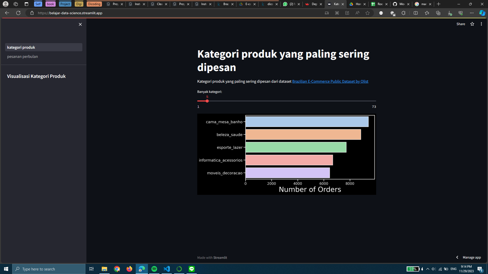
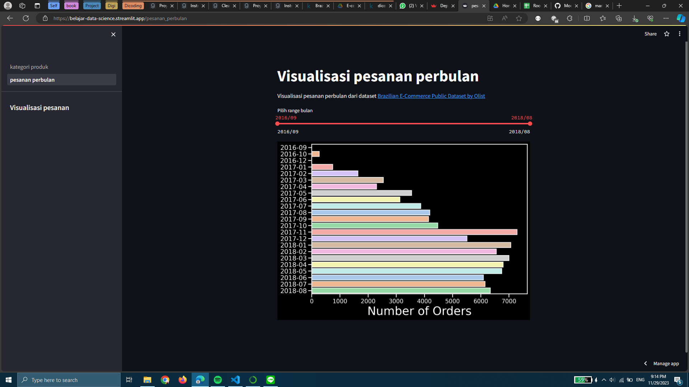

# Pengantar Data Science ✨

## Setup environment
```
conda create --name main-ds python=3.8
conda activate main-ds
pip install -r requirements.txt
```

## Run steamlit app
```
streamlit run kategori_produk.py
```

## Kaggle
[kaggle](https://www.kaggle.com/hithere7/dicoding-proyek-analisis-data)

## Deployment link
[streamlit](https://belajar-data-science.streamlit.app/)


